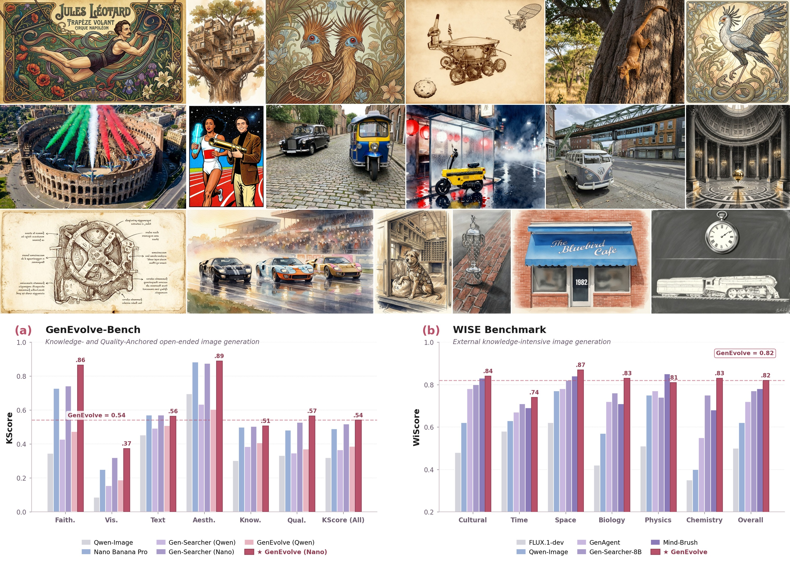
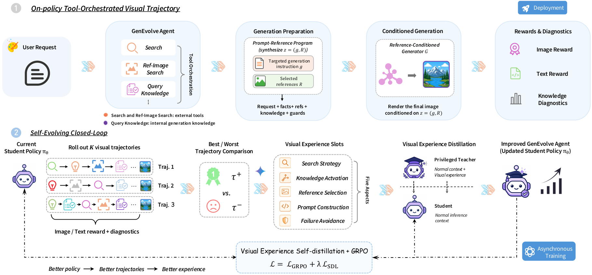

<div align="center">


<h1>GenEvolve</h1>

<p><strong><em>Self-Evolving Image Generation Agents via Tool-Orchestrated Visual Experience Distillation</em></strong></p>

<p>
  <a href="https://ephemeral182.github.io/GenEvolve/">
    </a>
  <a href="https://arxiv.org/abs/XXXX.XXXXX">
    </a>
  <a href="https://huggingface.co/Ephemeral182/GenEvolve-8B">
    </a>
  <a href="https://github.com/Ephemeral182/GenEvolve">
    </a>
</p>

<p>
  
  
  
  
  
</p>

</div>

## 👥 Authors

> [**Sixiang Chen**](https://ephemeral182.github.io/)<sup>1</sup>, [**Zhaohu Xing**](https://ge-xing.github.io/)<sup>1</sup>, [**Tian Ye**](https://owen718.github.io/)<sup>1</sup>, [**Xinyu Geng**](https://scholar.google.com/citations?user=rYB-IBwAAAAJ&hl=zh-CN)<sup>2</sup>, [**Yunlong Lin**](https://lyl1015.github.io/)<sup>3</sup>, [**Jianyu Lai**](https://alexlai2860.github.io/)<sup>1</sup>, [**Xuanhua He**](https://xuanhuahe.github.io/)<sup>2</sup>, [**Fuxiang Zhai**](https://fuxiangzhai.github.io/)<sup>1</sup>, [**Jialin Gao**](https://scholar.google.com/citations?user=sj4FqEgAAAAJ&hl=zh-CN)<sup>4</sup>, [**Lei Zhu**](https://sites.google.com/site/indexlzhu/home)<sup>1,2</sup>†
>
> <sup>1</sup>The Hong Kong University of Science and Technology (Guangzhou)
> 
> <sup>2</sup>The Hong Kong University of Science and Technology
> 
> <sup>3</sup>The Chinese University of Hong Kong
> 
> <sup>4</sup>National University of Singapore
>
> †Corresponding Author

---

<div align="center">


<p><em>The same trained agent policy paired with two reference-conditioned generators ⟶<br>
<strong>Qwen-Image-Edit (open)</strong> &nbsp;·&nbsp; <strong>Nano Banana Pro (strong)</strong></em></p>
</div>

## 🌟 What is GenEvolve?

GenEvolve formulates open-ended image generation as a **tool-orchestrated visual trajectory**. The agent gathers external textual evidence, retrieves visual references, performs **internal knowledge activation** through callable generation skills, and synthesizes a **prompt-reference program** $z = (g, R)$ that any reference-conditioned generator can render. Trained with GRPO + Visual Experience Distillation, the released `GenEvolve-8B` policy is **generator-transferable** — drop-in compatible with both open and strong proprietary renderers.

## 🧠 Method overview

<p align="center"></p>

For a user request $x$, the agent samples a multi-turn trajectory

$$\tau = (a_1, o_1, \ldots, a_T, o_T, z), \qquad z = (g, R),$$

where each $a_t$ is one of the three actions below and $o_t$ is the corresponding observation. The downstream generator renders $\hat{y} = G(g, R)$.

<table>
  <thead>
    <tr><th>Tool</th><th>Role</th><th>Output</th></tr>
  </thead>
  <tbody>
    <tr>
      <td><code>search(queries)</code></td>
      <td>External textual evidence — entities, dates, facts.</td>
      <td>Markdown digest.</td>
    </tr>
    <tr>
      <td><code>image_search(query)</code></td>
      <td>Visual references; each result gets a unique <code>IMG_###</code> id.</td>
      <td>Image list with local paths.</td>
    </tr>
    <tr>
      <td><code>query_knowledge(skill_name)</code></td>
      <td><strong>Internal knowledge activation</strong> — invokes one of the eight callable generation skills.</td>
      <td>Skill instructions in Markdown.</td>
    </tr>
  </tbody>
</table>

The final answer is a JSON object — the **prompt-reference program**:

```json
{
  "gen_prompt": "... a targeted instruction that refers to references by ordinal phrases ('the first reference image', 'the second reference image') ...",
  "reference_images": [
    {"img_id": "IMG_001", "note": "what to copy from this reference"}
  ]
}
```

## 🎁 What's released

| Component | Where |
|---|---|
| 🧠 Trained agent policy `GenEvolve-8B` (Qwen3-VL-8B-based) | 🤗 [`Ephemeral182/GenEvolve-8B`](https://huggingface.co/Ephemeral182/GenEvolve-8B) |
| ⚡ Standalone inference runtime (`GenEvolveAgent`, OpenAI-compatible) | this repo |
| 🛠️ Three tools (`search`, `image_search`, `query_knowledge`) | this repo |
| 📚 The eight skill markdown files used at training time | this repo |
| 🎨 Reference-conditioned generators (Qwen-Image-Edit + Nano Banana Pro) | this repo |
| 📦 SFT trajectories (8,800 train + 200 eval) | 🤗 [`Ephemeral182/GenEvolve-Data-SFT`](https://huggingface.co/datasets/Ephemeral182/GenEvolve-Data-SFT) |
| 🎯 Self-evolution prompts + GT images (2,575 train + 600 eval) | 🤗 [`Ephemeral182/GenEvolve-Data-RL`](https://huggingface.co/datasets/Ephemeral182/GenEvolve-Data-RL) |
| 📊 Held-out evaluation benchmark (594 prompts + GT images) | 🤗 [`Ephemeral182/GenEvolve-Bench`](https://huggingface.co/datasets/Ephemeral182/GenEvolve-Bench) |

## 📦 Data

We release three datasets on the Hugging Face Hub. The total trajectory data is too large for GitHub but installs in one line via 🤗 `datasets` / `huggingface-cli`.

| Dataset | Records | Size | Purpose |
|---|---|---|---|
| [`GenEvolve-Data-SFT`](https://huggingface.co/datasets/Ephemeral182/GenEvolve-Data-SFT) | 8,800 train + 200 eval | ~7.4 GB | Multi-turn tool-orchestrated trajectories used for the SFT cold start. Each record: `messages` (chat-format ReAct trajectory ending in `<answer>{gen_prompt, reference_images}`) + `images` (reference jpegs). |
| [`GenEvolve-Data-RL`](https://huggingface.co/datasets/Ephemeral182/GenEvolve-Data-RL) | 2,575 train + 600 eval | ~680 MB | Open-ended user requests paired with curated GT images. Used for GRPO + Visual Experience Distillation, where multiple agent rollouts per prompt are scored against the GT. |
| [`GenEvolve-Bench`](https://huggingface.co/datasets/Ephemeral182/GenEvolve-Bench) | 594 test | ~120 MB | Held-out evaluation benchmark. Contains both **Knowledge-Anchored** (T1, 335) and **Quality-Anchored** (T3, 259) tracks plus per-prompt category, difficulty, and skill metadata. |

### Quick load

```bash
# install once
pip install -U huggingface_hub datasets

# Download a dataset (chosen example: the held-out benchmark).
huggingface-cli download Ephemeral182/GenEvolve-Bench \
    --repo-type dataset --local-dir ./GenEvolve-Bench
```

```python
from datasets import load_dataset

# Held-out benchmark (594 prompts + bundled GT images).
bench = load_dataset("Ephemeral182/GenEvolve-Bench", split="test")
print(bench[0]["question"], bench[0]["gt_image"])

# RL self-evolution split (prompts + GT images for reward scoring).
rl = load_dataset("Ephemeral182/GenEvolve-Data-RL", split="train")

# SFT cold-start trajectories (chat-format with images).
sft = load_dataset("Ephemeral182/GenEvolve-Data-SFT", split="train")
print(sft[0]["messages"])
print(sft[0]["images"])
```

All paths inside the datasets are relative (e.g. `images/case_00512.jpg`, `images/traj_00213/IMG_001.jpg`); resolve them against the dataset directory you downloaded to. Per-dataset usage notes (LLaMA-Factory recipe, evaluation protocol, etc.) live on each dataset's Hub page.

> Although GenEvolve's training pipeline is not part of this repository, the released SFT and RL datasets together with the inference runtime here let you reproduce every step from the user request all the way to a generated image.

## 🚀 Quickstart

### 1️⃣ Install

```bash
git clone https://github.com/Ephemeral182/GenEvolve.git && cd GenEvolve
pip install -e .                      # core runtime
pip install -e ".[qwen]"              # optional: local Qwen-Image-Edit backend
```

### 2️⃣ Serve the released checkpoint

```bash
# vLLM (recommended)
MODEL_PATH=/path/to/GenEvolve-8B PORT=8000 TP=1 bash scripts/serve_vllm.sh

# or SGLang
MODEL_PATH=/path/to/GenEvolve-8B PORT=8000 TP=1 bash scripts/serve_sglang.sh
```

### 3️⃣ Run an end-to-end example

```bash
export SERPER_API_KEY=<your_key>             # required for search & image_search
export GOOGLE_API_KEY=<your_key>             # only for the Nano Banana Pro backend

python examples/quickstart.py \
    --backend nano-banana-pro \
    --base-url http://localhost:8000/v1 \
    --model GenEvolve-8B \
    --prompt "A 1990s travel-magazine cover of two backpackers in front of the Eiffel Tower at golden hour, the title \"PARIS\" rendered in bold serif type." \
    --output paris.png
```

Want the open-generator path? Swap `--backend qwen-image-edit` (defaults to `Qwen/Qwen-Image-Edit-2511`).

### 4️⃣ Batch pipeline

The agent rollout and the heavy image rendering are split into two stages so they can run on different machines.

```bash
# Stage 1 — agent rollouts → results.json (no images yet).
python scripts/run_agent.py \
    --input  examples/example_prompts.jsonl \
    --output-dir runs/example \
    --base-url http://localhost:8000/v1 \
    --model GenEvolve-8B \
    --parallel 4

# Stage 2a — render with Qwen-Image-Edit-2511 (open).
python scripts/generate_images.py \
    --input runs/example/results.json \
    --output-dir runs/example_qwen \
    --backend qwen-image-edit

# Stage 2b — render with Nano Banana Pro (strong).
python scripts/generate_images.py \
    --input runs/example/results.json \
    --output-dir runs/example_nano \
    --backend nano-banana-pro
```

## 🧩 Programmatic API

```python
from genevolve import GenEvolveAgent
from genevolve.generator import QwenImageEditGenerator   # or NanoBananaProGenerator

agent = GenEvolveAgent(
    model="GenEvolve-8B",
    base_url="http://localhost:8000/v1",
    api_key="EMPTY",
)
result = agent.run("A cyberpunk version of the Sydney Opera House at sunset.")

# z = (gen_prompt, reference_images)
print(result.gen_prompt)
for r in result.reference_images:
    print(r["img_id"], r["local_path"], r["note"])

backend = QwenImageEditGenerator(model_id="Qwen/Qwen-Image-Edit-2511")
image = backend.generate(
    result.gen_prompt,
    [r["local_path"] for r in result.reference_images if r.get("local_path")],
)
image.save("opera.png")
```

## 🖼️ Visual results

<p align="center"></p>

<p align="center"><sub>The same <code>GenEvolve-8B</code> policy paired with two different reference-conditioned generators. <span style="color:#D97706">Orange</span> marks external/uncommon knowledge, <span style="color:#2563EB">blue</span> marks internal generation-knowledge requirements.</sub></p>

## 📋 Requirements

<details>
<summary><strong>Core (always required)</strong></summary>

- Python ≥ 3.10
- `openai` ≥ 1.30
- `requests` ≥ 2.28
- `pillow` ≥ 10.0

</details>

<details>
<summary><strong>Local Qwen-Image-Edit backend (only if <code>--backend qwen-image-edit</code>)</strong></summary>

- `torch` ≥ 2.4
- `diffusers` ≥ 0.32 — must include `QwenImageEditPlusPipeline`
- `transformers` ≥ 4.45
- `accelerate` ≥ 0.30
- a CUDA-capable GPU with ≥ 24 GB VRAM (paper used H800 / A100)

```bash
pip install -e ".[qwen]"
```

</details>

<details>
<summary><strong>Inference server for the released checkpoint (pick one)</strong></summary>

- `vllm` ≥ 0.7 (recommended), or
- `sglang` ≥ 0.4

</details>

<details>
<summary><strong>External services</strong></summary>

| Service | Variable | Used for |
|---|---|---|
| [serper.dev](https://serper.dev) | `SERPER_API_KEY` | `search` and `image_search` |
| [Google Generative Language API](https://ai.google.dev/api) | `GOOGLE_API_KEY` | only with `--backend nano-banana-pro` |

</details>

## ⚙️ Configuration

| Variable | Purpose | Default |
|---|---|---|
| `OPENAI_BASE_URL` | OpenAI-compatible chat-completions endpoint | `http://localhost:8000/v1` |
| `OPENAI_API_KEY` | API key for the inference server | `EMPTY` |
| `SERPER_API_KEY` | [serper.dev](https://serper.dev) key (text + image search) | _required_ |
| `SERPER_BASE_URL` | Override for Serper-compatible gateways | `https://google.serper.dev` |
| `IMAGE_DOWNLOAD_DIR` | Local cache for `image_search` downloads | `/tmp/genevolve_images` |
| `GOOGLE_API_KEY` | Google Generative Language API key (Nano Banana Pro) | _required for Nano backend_ |

`GenEvolveAgent` constructor knobs — defaults follow our latest stable inference setting and are validated to work well with the released `GenEvolve-8B` weights:

| Argument | Default | Note |
|---|---|---|
| `max_rounds` | `11` | Max ReAct turns; the last turn is forced to emit `<answer>`. |
| `max_tokens_per_round` | `4096` | Per-turn max new tokens. |
| `temperature` | `0.6` | |
| `top_p` | `0.9` | |
| `max_prompt_length` | `6144` | Total prompt context length cap. |
| `max_response_length` | `30000` | Total trajectory response length cap. |
| `n_max_reference_images` | `2` | Max reference images forwarded to the downstream generator. |

## 🗂️ Repository layout

```
genevolve/
├── genevolve/
│   ├── agent.py               # GenEvolveAgent: ReAct loop on top of an OpenAI-compatible server
│   ├── system_prompt.py       # the system prompt used during training
│   ├── knowledge_tool.py      # query_knowledge: 8 callable generation skills
│   ├── tools/web_search.py    # search + image_search (Serper.dev compatible)
│   ├── generator.py           # Qwen-Image-Edit + Nano Banana Pro backends
│   └── knowledge/skills/      # 8 skill markdown files
├── scripts/
│   ├── serve_vllm.sh          # serve the checkpoint with vLLM
│   ├── serve_sglang.sh        # serve the checkpoint with SGLang
│   ├── run_agent.py           # batch agent rollouts → results.json
│   └── generate_images.py     # render images from results.json
├── examples/
│   ├── quickstart.py          # single-prompt end-to-end example
│   └── example_prompts.jsonl
├── assets/                    # README figures
├── requirements.txt
├── setup.py
└── README.md
```

## 🙏 Acknowledgements

GenEvolve builds directly on **[Gen-Searcher](https://github.com/RUCAIBox/Gen-Searcher)** and inherits its three-tool ReAct interface and dual image/text reward design. We thank the Gen-Searcher authors for making their work publicly available.

## 📝 Citation

```bibtex
@inproceedings{chen2026genevolve,
  title     = {GenEvolve: Self-Evolving Image Generation Agents via Tool-Orchestrated Visual Experience Distillation},
  author    = {Chen, Sixiang and Xing, Zhaohu and Ye, Tian and Geng, Xinyu and Lin, Yunlong and Lai, Jianyu and He, Xuanhua and Zhai, Fuxiang and Gao, Jialin and Zhu, Lei},
  booktitle = {Advances in Neural Information Processing Systems (NeurIPS)},
  year      = {2026}
}
```

## 📜 License

Code is released under the [Apache 2.0](LICENSE) license. Released model weights inherit the upstream license of `Qwen3-VL-8B-Instruct`. Search results returned by Serper.dev and images rendered by Nano Banana Pro / Qwen-Image-Edit are governed by the respective upstream service terms.

<div align="center">
<sub>If GenEvolve helps your research, a ⭐️ on GitHub is much appreciated.</sub>
</div>
